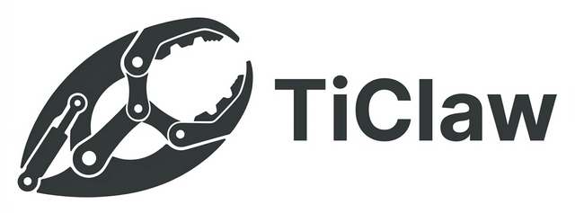

# 🦀 TiClaw

<p align="center">
  
</p>

<p align="center">
  <b>机器人心智构建平台。</b><br>
  多渠道、人格与记忆演化、生产级就绪。
</p>

<p align="center">
  Fork 自 <a href="https://github.com/qwibitai/nanoclaw">NanoClaw</a>
</p>

TiClaw 是机器人心智构建平台：人格与记忆在日常交互中持续演化。通过 Discord、飞书等渠道连接；心智随时间形成稳定个性与可用记忆，支持锁定、回滚与云同步部署。

## 🌊 愿景

**TiClaw** 是**机器人心智构建平台**。它专注于：
- **心智系统：** 人格与记忆在日常对话中演化；生产环境可锁定，需要时可回滚。
- **多渠道：** Discord、飞书等。一个心智，多种触达。
- **物理工厂：** 当机器人需要构建或修复时，提供隔离工作区。
- **💻 工作区技能：** 可选的编码 CLI（Gemini、Codex、Claude）— 仅在代理需要运行代码或访问仓库时使用。

## 🛠 核心能力

- **🧠 心智系统:** 人格与记忆在日常对话中演化。生产环境可锁定，需要时可回滚。`/mind` 用于状态、锁定、解锁、打包、对比、回滚。
- **🦀 工作区技能：** 代理直接处理大多数任务。当需要运行代码或访问仓库时，可使用可选的工作区技能（Gemini/Codex/Claude CLI）。物理 `~/ticlaw/factory/{folder}` 隔离。
- **📺 实时监控:** 工作区技能完成后将输出传至渠道。
- **📸 视觉审计:** 针对 UI 变更的自动 macOS 截图，以及由 Gemini 驱动的“Delta Feeds”代码变更摘要。
- **🚀 PR 管道:** 从“问题解决”到“PR 创建”的无缝切换，具备自动化的上下文感知描述（配置后）。

## 🚀 快速开始

```bash
git clone https://github.com/tiwater/ticlaw.git
cd ticlaw
pnpm install
# 配置 ~/ticlaw/config.yaml（channels: discord/feishu, llm 等）
pnpm start
```

## 我们为什么构建 TiClaw

TiClaw 在 [NanoClaw](https://github.com/qwibitai/nanoclaw) 基础上增加了**心智系统**：人格与记忆在交互中形成、跨会话持久化，并可锁定用于生产。透明度和可靠性是不可逾越的底线。

## 设计哲学

**默认透明：** 每一个 Shell 命令和日志都是实时流式传输的。不存在 AI 的“黑盒”操作。

**物理优于虚拟：** 虽然我们支持容器隔离，但我们更倾向于物理目录隔离，以确保原生性能，并能在需要时完全访问系统级工具（GPU、Keychain 等）。

**定制即代码修改：** 无配置泛滥。如果你需要不同的行为，直接修改 TiClaw 引擎代码。

## 系统要求

- macOS (专为 Mac Mini 优化) 或 Linux
- Node.js 20+
- [Gemini CLI](https://github.com/google/gemini)（工作区技能，headless 模式）或 [Claude Code](https://claude.ai/download)
- 至少一个渠道：[Discord](https://discord.com/developers/applications)、[飞书](docs/FEISHU_SETUP.md) 等

## 架构

TiClaw 运行在 **指挥 -> 工厂 -> 中继** 的循环中：

1.  **指挥:** 渠道（Discord、飞书等）接收消息；TiClaw 处理。
2.  **工厂:** 创建专用工作区。需要时以 headless 模式运行编码 CLI。
3.  **中继:** 日志、截图和 Diff 实时传回渠道。
4.  **验证:** Playwright 运行自动化 UI 测试。
5.  **交付:** PR 提交至 GitHub。

有关如何操作系统的完整指南，请参阅 [用户指南 (User Guide)](docs/USER_GUIDE.md)。

## 常见问题

**为什么工作区技能使用 headless 模式？**

工作区技能以 headless 模式运行编码 CLI（Gemini、Codex、Claude）— 无持久终端。每次提示都是新的子进程，保持系统简单且不依赖终端。

**我可以切换 Gemini 和 Claude 吗？**

可以。在 `.env` 中设置 `TC_CODING_CLI="claude"` 或 `TC_CODING_CLI="gemini"` 即可。

**这安全吗？**

TiClaw 使用物理隔离和端口锁定。然而，它是为受控环境设计的。请始终审查代码更改，并使用专用机器（如 Mac Mini）。

**我可以用于其他项目吗？**

当然！TiClaw 的 `/claw` 和工厂逻辑适用于任何托管在 GitHub 上的项目。

**我可以使用第三方 LLM 供应商吗？**

是的！TiClaw 默认使用 **OpenRouter**，它通过兼容 Anthropic 的 API 提供对 Claude 3.5 Sonnet 和其他强大模型的访问。你可以通过更新 `.env` 文件切换到原生的 Anthropic 或 Gemini。

## 致谢 (Credits)

TiClaw 自豪地构建在 **[NanoClaw](https://github.com/qwibitai/nanoclaw)** 的基础之上。我们保留了 NanoClaw 核心的消息路由和任务调度，并扩展了心智系统（人格、记忆、锁定、回滚）与多渠道支持。
